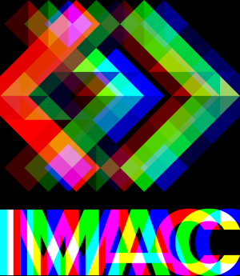
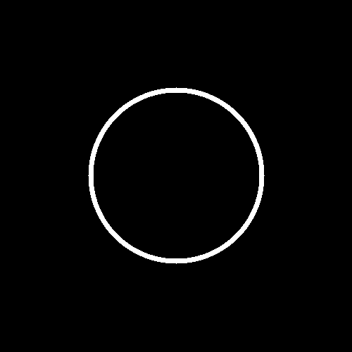
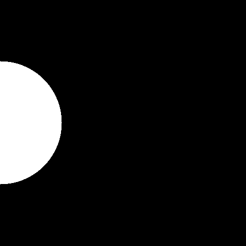
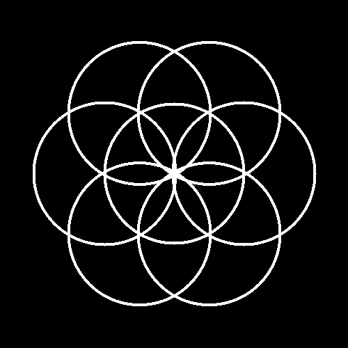
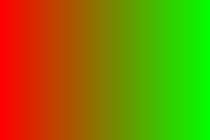
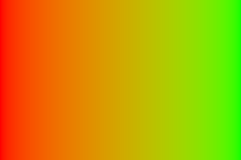
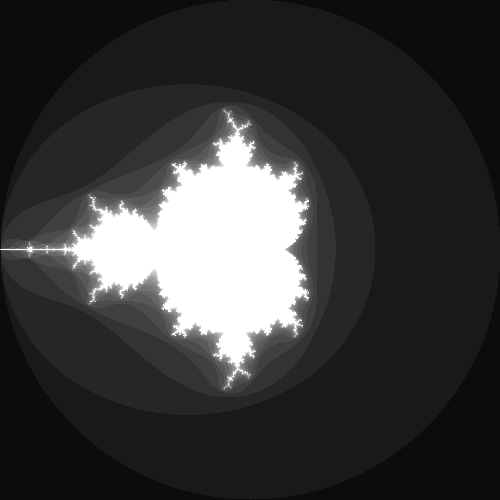
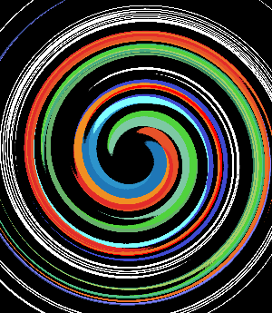

- [RAPPORT WORKSHOP](#rapport-workshop)
    - [Ex 1 - Ne garder que le vert](#ex-1---ne-garder-que-le-vert)
    - [Ex 2 - Échanger les canaux](#ex-2---échanger-les-canaux)
    - [Ex 3 - Noir \& Blanc](#ex-3---noir--blanc)
    - [Ex 4 - Négatif](#ex-4---négatif)
    - [Ex 5 - Dégradé](#ex-5---dégradé)
    - [Ex 6 - Miroir](#ex-6---miroir)
    - [Ex 7 - Image bruitée](#ex-7---image-bruitée)
    - [Ex 8 - Rotation de 90°](#ex-8---rotation-de-90)
    - [Ex 9 - RGB split](#ex-9---rgb-split)
    - [Ex 10 - Luminosité](#ex-10---luminosité)
    - [Ex 11 - Disque](#ex-11---disque)
    - [Ex 12 - Cercle](#ex-12---cercle)
    - [Ex 13 - Animation](#ex-13---animation)
    - [Ex 14 - Rosace](#ex-14---rosace)
    - [Ex 15 - Mosaïque](#ex-15---mosaïque)
    - [Ex 16 - Mosaïque miroir](#ex-16---mosaïque-miroir)
    - [Ex 17 - Glitch](#ex-17---glitch)
    - [Ex 18 - Dégradés dans l'espace de couleur Lab](#ex-18---dégradés-dans-lespace-de-couleur-lab)
    - [Ex 19 - Fractale de Mandelbrot](#ex-19---fractale-de-mandelbrot)
    - [Ex 20 - Normalisation de l'histogramme](#ex-20---normalisation-de-lhistogramme)
    - [Ex 21 - Vortex](#ex-21---vortex)

# RAPPORT WORKSHOP
**Louise Januel -- E3-IMAC**

J'ai effectué les exercices dans l'ordre, j'ai sauté deux exercices par souci de temps car je voulais absolument faire l'exercice du Vortex qui me plait beaucoup.

### Ex 1 - Ne garder que le vert

```cpp
void keep_green_only(sil::Image &image)
{
    for (glm::vec3 &color : image.pixels())
    {
        color.r = 0.f;
        color.b = 0.f;
    }
}
```


### Ex 2 - Échanger les canaux

```cpp
void swap_color(sil::Image &image)
{
    for (glm::vec3 &color : image.pixels())
    {
        std::swap(color.r, color.b);
    }
}
```


### Ex 3 - Noir & Blanc

```cpp
void grayscale(sil::Image &image)
{
    for (glm::vec3 &color : image.pixels())
    {
        float luminance{0.2126f * color.r + 0.7152f * color.g + 0.0722f * color.b};
        color.r = luminance;
        color.g = luminance;
        color.b = luminance;
    }
}
```


### Ex 4 - Négatif

```cpp
void negative(sil::Image &image)
{
    for (glm::vec3 &color : image.pixels())
    {
        color.r = 1.f - color.r;
        color.g = 1.f - color.g;
        color.b = 1.f - color.b;
    }
}
```


### Ex 5 - Dégradé

```cpp
void degrade(sil::Image &image)
{
    float largeur{static_cast<float>(image.width())};
    for (int x{0}; x < image.width(); x++)
    {
        float abscisse{static_cast<float>(x)};
        float pourcentage_abscisse{abscisse / largeur};
        for (int y{0}; y < image.height(); y++)
        {
            image.pixel(x, y).r = pourcentage_abscisse;
            image.pixel(x, y).g = pourcentage_abscisse;
            image.pixel(x, y).b = pourcentage_abscisse;
        }
    }
}
```
Pour cet exercice, j'ai considéré le pourcentage de la longueur totale que représente la distance séparant le pixel du bord gauche de l'image ; ce pourcentage augmentant de plus en plus au fur et à mesure que l'on se déplace vers la droite de l'image, on peut associé ce pourcentage à chacune des composantes de chaque pixel traité.


### Ex 6 - Miroir

```cpp
void miroir(sil::Image &image)
{
    sil::Image copie{image};
    for (int x{0}; x < image.width(); x++)
    {
        for (int y{0}; y < image.height(); y++)
        {
            image.pixel(x, y) = copie.pixel(copie.width() - (x + 1), y);
        }
    }
}
```


### Ex 7 - Image bruitée

```cpp
void bruit(sil::Image &image)
{
    for (int a{0}; a < 20000; a++)
    {
        image.pixel(random_int(0, image.width()), random_int(0, image.height())).r = random_float(0, 1);
        image.pixel(random_int(0, image.width()), random_int(0, image.height())).g = random_float(0, 1);
        image.pixel(random_int(0, image.width()), random_int(0, image.height())).b = random_float(0, 1);
    }
}
```


### Ex 8 - Rotation de 90°

```cpp
void rotation_90(sil::Image &image)
{
    sil::Image new_image{image.height(), image.width()};
    for (int x{0}; x < image.width(); x++)
    {
        for (int y{0}; y < image.height(); y++)
        {
            new_image.pixel(y, x) = image.pixel(image.width() - (x + 1), y);
        }
    }
    new_image.save("output/ex8.png");
}
```


### Ex 9 - RGB split

```cpp
void split_rgb(sil::Image &image)
{
    sil::Image new_image{image};
    for (int x{0}; x < image.width(); x++)
    {
        for (int y{0}; y < image.height(); y++)
        {
            if (25 <= x && x < image.width() - 25)
            {
                new_image.pixel(x, y).r = image.pixel(x + 25, y).r;
                new_image.pixel(x, y).b = image.pixel(x - 25, y).b;
            }
            if (x < 25)
            {
                new_image.pixel(x, y).r = image.pixel(x + 25, y).r;
            }
            if (image.width() - 25 < x)
            {
                new_image.pixel(x, y).b = image.pixel(x - 25, y).b;
            }
        }
    }
    new_image.save("output/ex9.png");
}
```

Ici, j'ai dû faire attention lorsqu'il a fallu traiter les bords droit et gauche de l'image. J'ai préféré inchanger la composante rouge sur la bordure gauche et bleu sur la bordure droite.



### Ex 10 - Luminosité

Dans cet exercice, on utilise la fonction x^(a) pour éclaircir ou assombrir notre image de manière uniforme. On applique cette fonction aux composantes de couleurs. On prend une valeur <1 si on souhaite éclaicir l'image, et >1 à l'inverse.

```cpp
void eclaircissement(sil::Image &image)
{
    for (glm::vec3 &color : image.pixels())
    {
        color.r = pow(color.r, 0.5);
        color.g = pow(color.g, 0.5);
        color.b = pow(color.b, 0.5);
    }
}
```


```cpp
void assombrissement(sil::Image &image)
{
    for (glm::vec3 &color : image.pixels())
    {
        color.r = pow(color.r, 2);
        color.g = pow(color.g, 2);
        color.b = pow(color.b, 2);
    }
}
```


### Ex 11 - Disque

```cpp
void disque(sil::Image &image)
{
    int centerX{image.width() / 2};
    int centerY{image.height() / 2};
    for (int x{0}; x < image.width(); x++)
    {
        for (int y{0}; y < image.height(); y++)
        {
            if (pow((x - centerX), 2) + pow((y - centerY), 2) <= pow(125, 2))
            {
                image.pixel(x, y).r = 1.f;
                image.pixel(x, y).g = 1.f;
                image.pixel(x, y).b = 1.f;
            }
        }
    }
}
```

On utilise ici l'equation paramétrique du cercle, et pour chaque composante, on verifie si elle se trouve à l'intèrieur du cercle. Si c'est le cas, on colore le pixel en blanc.


### Ex 12 - Cercle

```cpp
void cercle(float thickness, sil::Image &image)
{
    float centerX{image.width() / 2.f};
    float centerY{image.height() / 2.f};
    for (int x{0}; x < image.width(); x++)
    {
        for (int y{0}; y < image.height(); y++)
        {
            if ((pow((x - centerX), 2) + pow((y - centerY), 2) <= pow(100 + (thickness / 2), 2)) && (pow((x - centerX), 2) + pow((y - centerY), 2) >= pow(100 - (thickness / 2), 2)))
            {
                image.pixel(x, y).r = 1.f;
                image.pixel(x, y).g = 1.f;
                image.pixel(x, y).b = 1.f;
            }
        }
    }
}
```

On utilise le même programme que l'exercice précédent mais on ajoute une condition pour que les pixels colorés en blanc se trouvent entre deux cercles et non seulement à l'intèrieur d'un cercle.



### Ex 13 - Animation

```cpp
void animation(sil::Image &image)
{
    int centerY{image.height() / 2};
    for (int i{0}; i < 21; i++)
    {
        sil::Image copie{image};
        int centerX{i * (copie.width() / 20)};
        for (int x{0}; x < copie.width(); x++)
        {
            for (int y{0}; y < copie.height(); y++)
            {
                if (pow((x - centerX), 2) + pow((y - centerY), 2) <= pow(125, 2))
                {
                    copie.pixel(x, y).r = 1.f;
                    copie.pixel(x, y).g = 1.f;
                    copie.pixel(x, y).b = 1.f;
                }
            }
        }
        copie.save("output/ex13-" + std::to_string(i) + ".png");
    }
}
```

Ici on ajoute une boucle qui permet de déplacer le centre du disque et qui sauvegarde chaque nouvelle image du GIF à chaque itérations.



### Ex 14 - Rosace

```cpp
void cercle_avec_centre(float thickness, sil::Image &image, float rayon, float centerX, float centerY)
{
    for (int x{0}; x < image.width(); x++)
    {
        for (int y{0}; y < image.height(); y++)
        {
            if ((pow((x - centerX), 2) + pow((y - centerY), 2) <= pow(rayon + (thickness / 2), 2)) && (pow((x - centerX), 2) + pow((y - centerY), 2) >= pow(rayon - (thickness / 2), 2)))
            {
                image.pixel(x, y).r = 1.f;
                image.pixel(x, y).g = 1.f;
                image.pixel(x, y).b = 1.f;
            }
        }
    }
}

void rosace(float thickness, sil::Image &image)
{
    cercle(thickness, image);
    for (float i{0}; i <= (5 * M_PI) / 3; i += M_PI / 3)
    {
        cercle_avec_centre(thickness, image, 100 + thickness / 2, (image.width() / 2) + 100 * cos(i), (image.height() / 2) + 100 * sin(i));
    }
}
```

J'ai d'abord défini une fonction `cercle_avec_centre` qui permet de dessiner un cercle à partir d'une `thickness`, d'un `centre` et d'un `rayon` donnés. On l'utilise ensuite pour tracer 6 cercles à intervalles réguliers (tous les angles de π/3) sur un premier cercle ('de même `rayon` et `thickness`) centré sur l'image.



### Ex 15 - Mosaïque

```cpp
void mosaique(int nbr, sil::Image &image)
{
    sil::Image new_image{nbr * image.width(), nbr * image.height()};
    for (int i{0}; i < nbr; i++)
    {
        for (int j{0}; j < nbr; j++)
        {
            for (int x{0}; x < image.width(); x++)
            {
                for (int y{0}; y < image.height(); y++)
                {
                    new_image.pixel(x + i * image.width(), y + j * image.height()) = image.pixel(x, y);
                }
            }
        }
    }
    new_image.save("output/ex15.png");
}
```

J'utilise ici deux indices (sur les abscisses et sur les ordonnées de ma nouvelles image) pour constituer ma mosaïque.


### Ex 16 - Mosaïque miroir

```cpp
void mosaique_miroir(int nbr, sil::Image &image)
{
    sil::Image new_image{nbr * image.width(), nbr * image.height()};
    for (int j{0}; j < nbr; j++)
        for (int i{0}; i < nbr; i++)
        {
            if (j % 2 == 0)
            {
                if (i % 2 == 0)
                    for (int x{0}; x < image.width(); x++)
                        for (int y{0}; y < image.height(); y++)
                            new_image.pixel(x + i * image.width(), y + j * image.height()) = image.pixel(x, y);
                if (i % 2 == 1)
                    for (int x{0}; x < image.width(); x++)
                        for (int y{0}; y < image.height(); y++)
                            new_image.pixel(x + i * image.width(), y + j * image.height()) = image.pixel(image.width() - (x + 1), y);
            }
            if (j % 2 == 1)
            {
                if (i % 2 == 0)
                    for (int x{0}; x < image.width(); x++)
                        for (int y{0}; y < image.height(); y++)
                            new_image.pixel(x + i * image.width(), y + j * image.height()) = image.pixel(x, image.height() - (y + 1));
                if (i % 2 == 1)
                    for (int x{0}; x < image.width(); x++)
                        for (int y{0}; y < image.height(); y++)
                            new_image.pixel(x + i * image.width(), y + j * image.height()) = image.pixel(image.width() - (x + 1), image.height() - (y + 1));
            }
        }
    new_image.save("output/ex16.png");
}
```

Dans la même idée que le programme précédent, on utilise encore deux indices. Cependant ici on utilise des conditions sur ces indices pour dessiner l'image dans le sens standard, retournée verticalement, retournée horizontalement ou bien retournée dans les deux sens. On utilise un `%2` pour évaluer la place de la petite image dans la grande image.


### Ex 17 - Glitch

```cpp
void glitch(sil::Image &image)
{
    for (int a{0}; a < 200; a++)
    {
        int longu{random_int(10, 20)};
        int larg{random_int(1, 6)};
        int x_rect1{random_int(0, image.width() - (longu + 1))};
        int y_rect1{random_int(0, image.height() - (larg + 1))};
        int x_rect2{random_int(0, image.width() - (longu + 1))};
        int y_rect2{random_int(0, image.height() - (larg + 1))};
        for (int x{0}; x < longu; x++)
            for (int y{0}; y < larg; y++)
                std::swap(image.pixel(x_rect1 + x, y_rect1 + y), image.pixel(x_rect2 + x, y_rect2 + y));
    }
}
```

Ici on utilise des paramètres au hasard pour déterminer la taille des rectangles que l'on veut échanger, mais également l'emlacement de ces rectangles.
On utilise ensuite la fonction `std::swap(a, b)` pour échanger les pixels des deux rectangles.


### Ex 18 - Dégradés dans l'espace de couleur Lab

On souhaite créer un dégradé horizontal entre le rouge et le vert sur une image. En restant dans l'espace de couleurs sRGB on obtient, grâce à ce programme : 

```cpp
void degrade_couleur1(sil::Image &image)
{
    float largeur{static_cast<float>(image.width())};
    for (int x{0}; x < image.width(); x++)
    {
        float abscisse{static_cast<float>(x)};
        float pourcentage_abscisse{abscisse / largeur};
        for (int y{0}; y < image.height(); y++)
        {
            image.pixel(x, y).r = 1 - pourcentage_abscisse;
            image.pixel(x, y).g = pourcentage_abscisse;
            image.pixel(x, y).b = 0.f;
        }
    }
}
```

ce premier dégradé : 



Les couleurs du centre restent très sombres, on souhaite donc l'améliorer en passant par l'espace colorimétrique Oklab pour obtenir un rendu précis et naturel.
Il nous faut pour cela créer la strucutre Lab qui permet de contenir les composantes des couleurs lorsqu'elles sont exprimées dans l'espace colorimétrique Oklab.

```cpp
struct Lab
{
    float L;
    float a;
    float b;
};
```
On trvaille habituellement dans l'espace colorimétrique sRGB. Il nous faut pour cela convertir, nos couleurs depuis l'espace colorimétrique sRGB en linearRGB puis en Oklab. Voici toutes les fonctions de conversion : 

```cpp
float sRGBToLinear(float c)
{
    if (c <= 0.04045)
    {
        return c / 12.92;
    }
    else
    {
        return pow((c + 0.055) / 1.055, 2.4);
    }
}

glm::vec3 convertSRGBToLinearRGB(const glm::vec3 &srgb)
{
    return {
        sRGBToLinear(srgb[0]),
        sRGBToLinear(srgb[1]),
        sRGBToLinear(srgb[2])};
}

float linearToSRGB(float c)
{
    if (c <= 0.0031308)
    {
        return c * 12.92;
    }
    else
    {
        return 1.055 * pow(c, 1.0 / 2.4) - 0.055;
    }
}

glm::vec3 convertLinearRGBToSRGB(const glm::vec3 &linearRGB)
{
    return {
        linearToSRGB(linearRGB[0]),
        linearToSRGB(linearRGB[1]),
        linearToSRGB(linearRGB[2])};
}

Lab srgb_to_oklab(glm::vec3 c)
{
    c = convertSRGBToLinearRGB(c);
    float l = 0.4122214708f * c.r + 0.5363325363f * c.g + 0.0514459929f * c.b;
    float m = 0.2119034982f * c.r + 0.6806995451f * c.g + 0.1073969566f * c.b;
    float s = 0.0883024619f * c.r + 0.2817188376f * c.g + 0.6299787005f * c.b;

    float l_ = cbrtf(l);
    float m_ = cbrtf(m);
    float s_ = cbrtf(s);

    return {
        0.2104542553f * l_ + 0.7936177850f * m_ - 0.0040720468f * s_,
        1.9779984951f * l_ - 2.4285922050f * m_ + 0.4505937099f * s_,
        0.0259040371f * l_ + 0.7827717662f * m_ - 0.8086757660f * s_,
    };
}

glm::vec3 oklab_to_srgb(Lab c)
{
    float l_ = c.L + 0.3963377774f * c.a + 0.2158037573f * c.b;
    float m_ = c.L - 0.1055613458f * c.a - 0.0638541728f * c.b;
    float s_ = c.L - 0.0894841775f * c.a - 1.2914855480f * c.b;

    float l = l_ * l_ * l_;
    float m = m_ * m_ * m_;
    float s = s_ * s_ * s_;

    glm::vec3 b = {
        +4.0767416621f * l - 3.3077115913f * m + 0.2309699292f * s,
        -1.2684380046f * l + 2.6097574011f * m - 0.3413193965f * s,
        -0.0041960863f * l - 0.7034186147f * m + 1.7076147010f * s,
    };
    return {convertLinearRGBToSRGB(b)};
}
```

Maintenant qu'on peut convertir nos couleurs dans l'espace qui convient, on peut fappliquer le programme pour constituer le dégradé, que voici : 

```cpp
void degrade_couleur2(sil::Image &image)
{
    Lab red_en_lab = srgb_to_oklab({1, 0, 0});
    Lab green_en_lab = srgb_to_oklab({0, 1, 0});
    float largeur{static_cast<float>(image.width())};
    for (int x{0}; x < image.width(); x++)
    {
        float abscisse{static_cast<float>(x)};
        float pourcentage_abscisse{abscisse / largeur};
        for (int y{0}; y < image.height(); y++)
        {
            image.pixel(x, y).r = red_en_lab.L * (1 - pourcentage_abscisse) + green_en_lab.L * pourcentage_abscisse;
            image.pixel(x, y).g = red_en_lab.a * (1 - pourcentage_abscisse) + green_en_lab.a * pourcentage_abscisse;
            image.pixel(x, y).b = red_en_lab.b * (1 - pourcentage_abscisse) + green_en_lab.b * pourcentage_abscisse;
            image.pixel(x, y) = oklab_to_srgb({image.pixel(x, y).r, image.pixel(x, y).g, image.pixel(x, y).b});
        }
    }
}
```

Dans ce programme, les boucles imbriquées parcourent chaque pixel de l'image : la boucle externe traite les colonnes, calculant le pourcentage de progression horizontal, tandis que la boucle interne ajuste les composantes Oklab de chaque pixel en fonction de ce pourcentage. Chaque pixel est ensuite reconverti en sRGB pour afficher le dégradé final.

Voici notre dégradé : 



Il est bien mieux que le premier, non ?

### Ex 19 - Fractale de Mandelbrot

**Présentation de la Fractale de Mandelbrot :**

La fractale de Mandelbrot s'obtient ainsi : pour chaque nombre complexe `c` (correspondant à la position d'un pixel), on initialise un autre nombre complexe `z` à 0, puis on itère `z = z * z + c` un certain nombre de fois. Si le nombre `z` commence à devenir de plus en plus grand, alors `c` ne fait pas partie de la fractale et on colorie le pixel correspondant en noir. À l'inverse, si `z` reste de taille modérée peu importe le nombre d'itérations qu'on fait, alors le pixel fait partie de la fractale et on le colorie en blanc.

Plus précisément, on peut prouver que dès que `std::abs(z) > 2` alors le nombre `z` va forcément finir par grandir de plus en plus. On peut donc s'arrêter d'itérer dès que `std::abs(z) > 2`. Et pour obtenir une fractale plus jolie, plutôt que d'assigner du noir pur on peut assigner un gris plus ou moins sombre en fonction du nombre d'itérations qu'il a fallu faire avant que `std::abs(z) > 2`.

**Voici mon programme :**

```cpp
void fractale(sil::Image &image)
{
    const float x_min = -2.0f, x_max = 2.0f;
    const float y_min = -2.0f, y_max = 2.0f;
    const int max_iterations = 20;

    for (int px = 0; px < image.width(); ++px)
    {
        for (int py = 0; py < image.height(); ++py)
        {
            float x = x_min + (x_max - x_min) * px / image.width();
            float y = y_min + (y_max - y_min) * py / image.height();

            std::complex<float> c{x, y};
            std::complex<float> z{0.0f, 0.0f};

            int iterations = 0;
            while (iterations < max_iterations && std::abs(z) <= 2.0f)
            {
                z = z * z + c;
                ++iterations;
            }
            float intensity = static_cast<float>(iterations) / max_iterations;
            image.pixel(px, py) = {intensity, intensity, intensity};
        }
    }
}
```
Pour les nuances de gris, j'ai divisé le nombre d'itérations effecté sur le nombre total d'itérations (ici 20), ce qui me donne un pourcentage que je peux donc utiliser comme luminance, et donc l'injecter dans chacune des composantes de mon pixel pour obtenir des nuances de gris.

Et voici le résultat : 



### Ex 20 - Normalisation de l'histogramme

Le but ici est de trouver le pixel le moins lumineux et le pixel le plus lumineux de l'image, et d'appliquer une transformation à chaque pixel de sorte à ce que le pixel le plus sombre devienne un noir pur `(0)` et le plus lumineux devienne un blanc pur `(1)`.

**Voici mon programme :**

```cpp
void normalisation(sil::Image &image)
{
    float min_luminance{1.0f};
    float max_luminance{0.0f};

    for (int y = 0; y < image.height(); ++y)
    {
        for (int x = 0; x < image.width(); ++x)
        {
            glm::vec3 pixel = image.pixel(x, y);
            float luminance{0.2126f * pixel.r + 0.7152f * pixel.g + 0.0722f * pixel.b};
            min_luminance = std::min(min_luminance, luminance);
            max_luminance = std::max(max_luminance, luminance);
        }
    }

    for (int y = 0; y < image.height(); ++y)
    {
        for (int x = 0; x < image.width(); ++x)
        {
            glm::vec3 pixel{image.pixel(x, y)};
            glm::vec3 normalized = (pixel - min_luminance) / (max_luminance - min_luminance);
            image.pixel(x, y) =normalized;
        }
    }
}
```
La première boucle `for` permet de déterminer quels sont les deux pixels les plus et moins lumineux. 
La deuxième boucle `for` permet d'appliquer la nouvelle luminance, après l'avoir calculer, à chacun des pixels.

**Avant :**


**Après :**


### Ex 21 - Vortex

L'effet Vortex consiste à faire tourner chaque pixel d'une image en fonction de sa distance par rapport au centre de l'image. Je le trouve très beau et intéressant ! 

```cpp
glm::vec2 rotated(glm::vec2 point, glm::vec2 center_of_rotation, float angle)
{
    return glm::vec2{glm::rotate(glm::mat3{1.f}, angle) * glm::vec3{point - center_of_rotation, 0.f}} + center_of_rotation;
}

void vortex(sil::Image &image)
{
    
    sil::Image new_image{image.width(), image.height()};
    float centerX{image.width() / 2};
    float centerY{image.height() / 2};
    for (int x{0}; x < image.width(); x++)
    {
        for (int y{0}; y < image.height(); y++)
        {
            float distance_au_centre {glm::distance(glm::vec2{x, y},glm::vec2{centerX, centerY})};
            float angle{0.1 * distance_au_centre + 2*M_PI};

            float new_x{rotated({x, y}, {centerX, centerY}, angle).x};
            float new_y{rotated({x, y}, {centerX, centerY}, angle).y};
            if (new_x > 0 && new_x < image.width() && new_y > 0 && new_y < image.height())
                new_image.pixel(x, y) = image.pixel(new_x, new_y);
            else
            {
                new_image.pixel(x, y) = {0, 0, 0};
            }
        }
    }
    new_image.save("output/ex21.png");
}
```

La fonction `rotated` calcule la nouvelle position d'un point après une rotation autour d'un centre donné. Dans `vortex`, chaque pixel de l'image est parcouru pour déterminer sa distance au centre, puis un angle proportionnel à cette distance est utilisé pour appliquer une rotation en spirale. Les pixels de l'image d'origine sont transférés à leurs nouvelles positions dans une image finale, avec des valeurs par défaut `(0)` pour les pixels hors limites.

**Voici le résultat du programme appliqué au logo de l'IMAC :**


